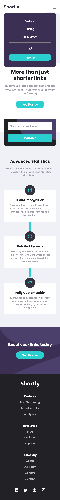

# Frontend Mentor - Shortly URL shortening API Challenge solution

This is a solution to the [Shortly URL shortening API Challenge challenge on Frontend Mentor](https://www.frontendmentor.io/challenges/url-shortening-api-landing-page-2ce3ob-G). Frontend Mentor challenges help you improve your coding skills by building realistic projects. 

## Table of contents

- [Overview](#overview)
  - [The challenge](#the-challenge)
  - [Screenshot](#screenshot)
  - [Links](#links)
- [My process](#my-process)
  - [Built with](#built-with)
  - [What I learned](#what-i-learned)
  - [Continued development](#continued-development)
  - [Useful resources](#useful-resources)
- [Author](#author)

## Overview

### The challenge

Users should be able to:

- View the optimal layout for the site depending on their device's screen size
- Shorten any valid URL
- See a list of their shortened links, even after refreshing the browser
- Copy the shortened link to their clipboard in a single click
- Receive an error message when the `form` is submitted if:
  - The `input` field is empty

### Screenshot
<table>
  <tr>
    <td>
      
      
    </td>
  </tr>
  <tr>
    <td>
      
    </td>
  </tr>
  <tr>
    <td>
    
    </td>
  </tr>
</table>

### Links

- Solution URL: [here](https://your-solution-url.com)
- Live Site URL: [here](https://zun-liang.github.io/url-shortening-api/)

## My process

### Built with

- Semantic HTML5 markup
- CSS custom properties
- Flexbox
- CSS Grid
- Mobile-first workflow
- [React](https://reactjs.org/) - JS library
- [Styled Components](https://styled-components.com/) - For styles

### What I learned

- vertical-align: baseline/top/middle/bottom/sub/text-top...
- input type="url"
- toSpliced()
- React Dev Tools
- localStorage
- navigator clipboard
- useRef

### Continued development

#### Ways of React Data Fetching
- axois
- asynch/await
- useFetch
- React Query

#### Advanced React
- useCallBack
- useMemo
- React Error Boundaries

### Useful resources
#### HTML Related
- [input type="url"](https://developer.mozilla.org/en-US/docs/Web/HTML/Element/input/url)

#### CSS Related
- [Input placeholder vertical align](https://stackoverflow.com/questions/38854712/input-placeholder-vertical-align)
- [Preventing a Grid Blowout](https://css-tricks.com/preventing-a-grid-blowout/)

#### Javascript Related
- [Check if an URL is valid or not using Regular Expression](https://www.geeksforgeeks.org/check-if-an-url-is-valid-or-not-using-regular-expression/)
- [Array.prototype.toSpliced()](https://developer.mozilla.org/en-US/docs/Web/JavaScript/Reference/Global_Objects/Array/toSpliced)
- [Learn how to handle JavaScript Errors with Try, Throw, Catch, & Finally](https://codeburst.io/learn-how-to-handle-javascript-errors-with-try-throw-catch-finally-83b4f9ef8c6f)
- [Using .then(), .catch(), .finally() to Handle Errors in Javascript Promises](https://lucymarmitchell.medium.com/using-then-catch-finally-to-handle-errors-in-javascript-promises-6de92bce3afc)
- [JavaScript ‘throw new Error’ vs ‘throw Error’ vs ‘throw something’](https://www.codingem.com/javascript-throw-new-error-vs-throw-error/)

#### React Related
- [How to Use React Dev Tools – With Example Code and Videos](https://www.freecodecamp.org/news/how-to-use-react-dev-tools/)
- [I’ve updated the state, but logging gives me the old value](https://react.dev/reference/react/useState#ive-updated-the-state-but-logging-gives-me-the-old-value)
- [Rendering Lists](https://react.dev/learn/rendering-lists)
- [How to Use localStorage with React Hooks to Set and Get Items](https://www.freecodecamp.org/news/how-to-use-localstorage-with-react-hooks-to-set-and-get-items/)
- [Understanding the Difference Between Named and Default Exports in React](https://betterprogramming.pub/understanding-the-difference-between-named-and-default-exports-in-react-2d253ca9fc22)
- [Understanding React’s useEffect cleanup function](https://blog.logrocket.com/understanding-react-useeffect-cleanup-function/)

#### Web APIs Related
- [Navigator: clipboard property](https://developer.mozilla.org/en-US/docs/Web/API/Navigator/clipboard)
- [Clipboard: writeText() method](https://developer.mozilla.org/en-US/docs/Web/API/Clipboard/writeText)
- [Local Storage vs Session Storage vs Cookie](https://www.xenonstack.com/insights/local-vs-session-storage-vs-cookie)
- [Storage: key() method](https://developer.mozilla.org/en-US/docs/Web/API/Storage/key)
- [What’s The Difference Between Cache And Cookies](https://medium.com/techblogout/whats-the-difference-between-cache-and-cookies-53e7f4f094bb)
- [shrtcode API Documentation](https://shrtco.de/docs)

## Author

- Website - [Zun Liang](https://zun-liang.github.io/)
- Frontend Mentor - [@zun-liang](https://www.frontendmentor.io/profile/zun-liang)

